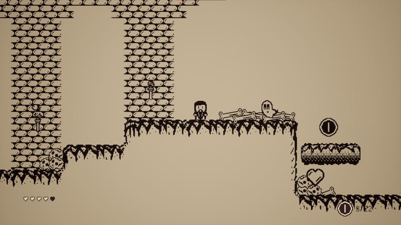

##Charon's Coins

[Charon's Coins](https://senseilx.itch.io/charonscoins) is a 2-D platformer game made for the Black and White Game Jam.

As the lead programmer, my duties included programming most of the necessary code in Unreal 4 using both Blueprints and C++, building the UI, and collaboration with the Game Designer and Level Designer to meet the needs of the game jam.

